## CONFIGURACIÓN DEL TJBOT

 
  
<b> 1.3.	SERVICIOS DE WATSON </b>       

 Para realizar el proyecto final del TJBot, vamos a utilizar tres servicios de Watson: Text to Speech, 
 Speech to Text y Watson Assistant.
    
<b> 1.3.1.	TEXT TO SPEECH </b>    

 El servicio Text to Speech proporciona una interfaz de programación de aplicaciones que utiliza   
las capacidades de síntesis de voz de IBM para convertir texto escrito en voz de sonido natural.      
Para crear un servicio Text to Speech de Watson, debemos buscarlo en el catálogo de IBM Cloud.      

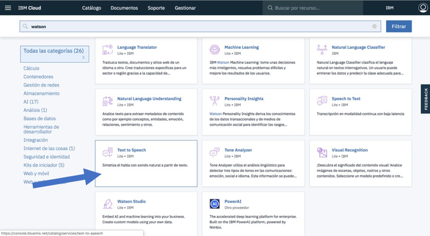    

 Una vez seleccionado el servicio deseado, le damos al botón de "Crear" para poder empezar a trabajar.
    
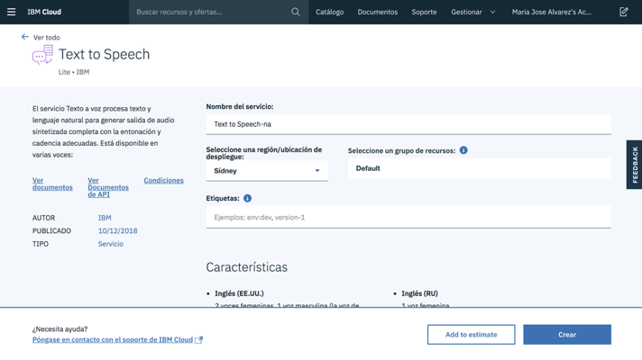    

 Cuando ya tenemos nuestro servicio creado, podemos acceder a él desde nuestro Dashboard.
    
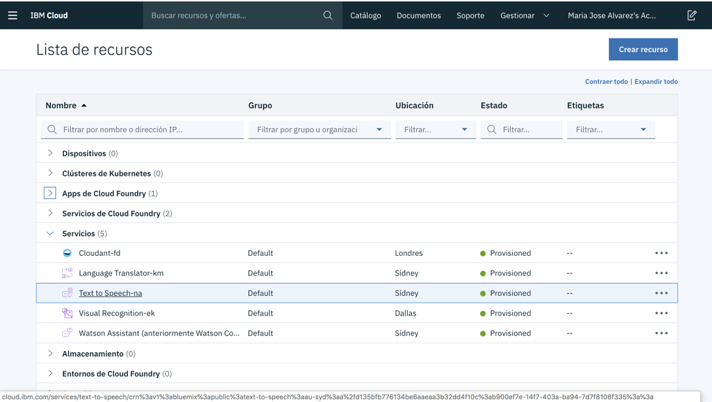    

 En el apartado Service credentials (credenciales del servicio) podemos ver nuestro usuario y  
contraseña, que necesitaremos incluir más adelantes cuando configuremos el servicio Text to  
Speech en nuestra Raspberry Pi3.
     

 ¡Hemos creado nuestro servicio Text to Speech! 
    
<b> 1.3.2.	SPEECH TO TEXT </b>    

 Para crear un servicio Speech to Text de Watson, debemos buscarlo en el catálogo de IBM Cloud.
  
 
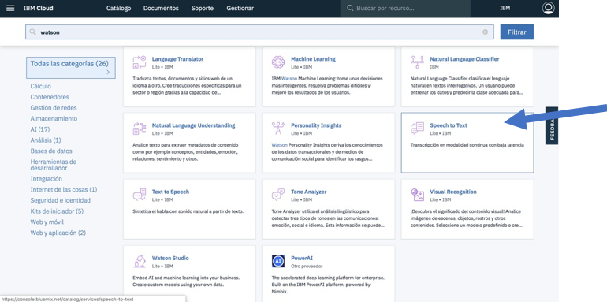    

 Una vez seleccionado el servicio deseado, le damos al botón de "Crear" para poder empezar a trabajar.
    
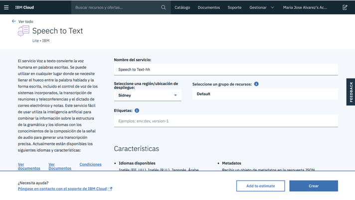    

 Cuando ya tenemos nuestro servicio creado, podemos acceder a él desde nuestro Dashboard.
    
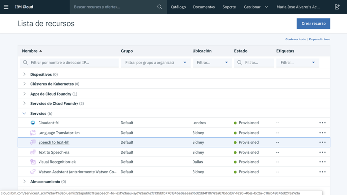    

 En el apartado Service credentials (credenciales del servicio) podemos ver nuestro usuario y  
contraseña, que necesitaremos incluir más adelantes cuando configuremos el servicio Speech to  
Text en nuestra Raspberry Pi3. 
      

¡Hemos creado nuestro servicio Speech to Text!
    
<b> 1.3.3.	ASSISTANT </b>       

 Para crear un servicio de Watson Assistant, debemos buscar el servicio deseado en el catálogo de IBM Cloud.
    
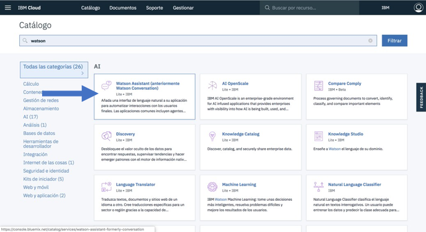    

 Una vez seleccionado el servicio Assistant, le damos al botón de "Crear" para poder empezar a trabajar.
    
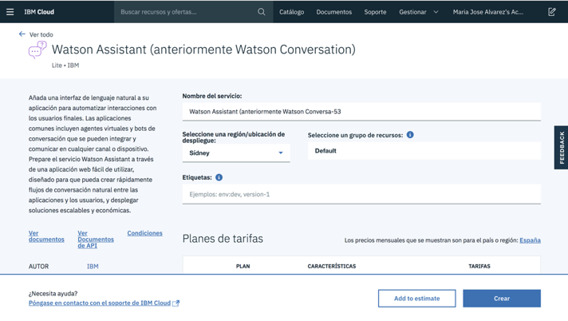      
<a href="https://watsonvaclase.github.io/Conversation/" > Pulsa aquí para acceder al manual de cómo crear una conversación con el servicio de Watson Assistant</a>    

 Cuando ya tenemos nuestro servicio creado, podemos acceder a él desde nuestro Dashboard.    
Una vez la página principal de nuestro servicio, debemos buscar el botón "Launch tool" que nos llevará a la herramienta  
en la que configuraremos y desarrollaremos nuestra conversación.     
En el apartado Service credentials (credenciales del servicio) podemos ver nuestro usuario y contraseña, que  
 necesitaremos incluir más adelantes cuando configuremos el servicio Assistant en nuestra Raspberry Pi3.      

<b> 1.4.	CONFIGURAR A TJBOT  </b>       
<b> 1.4.1.	CONFIGURAR LA RASPBERRY PI 3  </b>    
Como ya hemos mencionado, Raspberry Pi es similar a un computador completo, lo que significa que se necesita un monitor, ratón y teclado para utilizarla. [1]    
Se puede conectar a un televisor a través de un cable HDMI.
  
También será necesario conectar la Raspberry a la Wifi.   

En la mayoría de los kits Pi, la tarjeta SD ya está precargada con una imagen del sistema operativo Raspberry Pi.   
Se debe colocar la tarjeta SD en la Pi, encender la Pi y seguir las instrucciones en la pantalla para completar la  
instalación del sistema operativo.   

Una vez tenemos todo preparado, hay que configurar los paquetes para empezar a trabajar.  
 
 
Abrimos un terminal en el Pi y ejecutamos los siguientes comandos para instalar la última versión de Node.js y  
npm (Node Package Manager). Necesitará estos paquetes más tarde para ejecutar su código.  

Para ello utilizamos el siguiente comando:    

> curl -sL http://ibm.biz/tjbot-bootstrap | sudo sh -  

A continuación, será necesario configurar la salida de audio; el audio puede tener 2 opciones: 
 HDMI o Jack.  

Abrimos un terminal, y escribimos el siguiente comando, para abrir la configuración de las Raspberry:    
> sudo raspi-config  

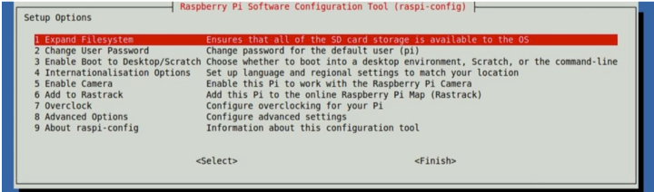    

 Seleccionamos "Opciones avanzadas" y luego seleccionamos "Audio". Elegimos el canal correcto  
para el audio de salida. Si hemos conectado un altavoz externo a la toma de audio, debemos seleccionar la toma de 3,5 mm.

     
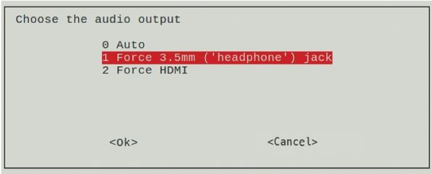      
<b> 1.4.2.	OBTENER EL CÓDIGO PARA TJBOT </b>    

 Una vez tenemos todo configurado, necesitamos descargar el código base para el TJBot.  
Podemos hacerlo mediante los siguientes comandos:  
 
> git clone https://github.com/ibmtjbot/tjbot.git  
> cd tjbot/recipes/conversation  
> npm install  

Una vez tenemos el código instalado, tenemos que empezar a configurar los servicios de Watson.  
Como ya hemos dicho, los servicios que vamos a utilizar son 3: Text to Speech, Assistant y Speech to Text.    

    

 Recordemos que los tres servicios estaban ya creados; ahora lo único que necesitaremos serán  
las credenciales para poder añadirlas al código de configuración del TJBot.  
Necesitamos abrir el archivo config.js para actualizar dicha información. Para ello, primero  
hacemos una copia del archivo original (config.default.js) mediante el siguiente comando:  
cp config.default.js config.js    
Una vez hecho, abrimos el archive config.js y actualizamos las credenciales de los servicios.   
Será necesaria la apikey y URL del servicio, en el caso de Watson Assistant, el WorkspaceID.    

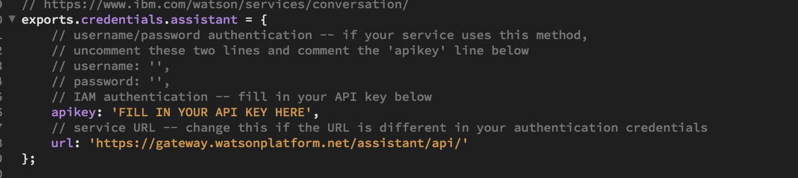    
<b> 1.4.3.	PROBANDO A TJBOT </b>      

 Una vez tenemos todo configurado y la conversación creada, podemos probar a TJBot.  
Abrimos el terminal y ejecutamos el siguiente comando:  
sudo node conversation.js  

  
<b> ¡Ya puedes hablar con TJBot! </b>
